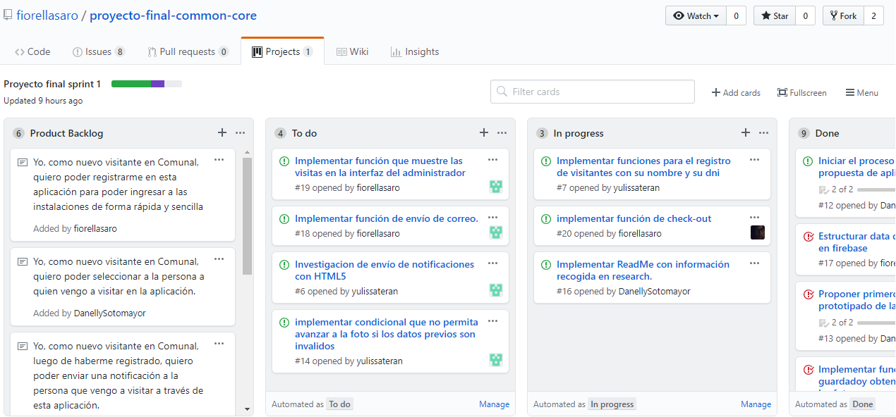
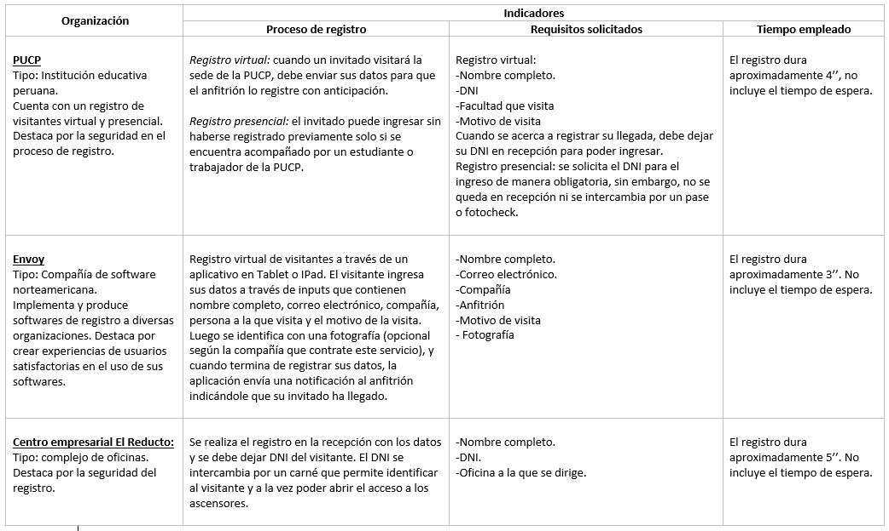
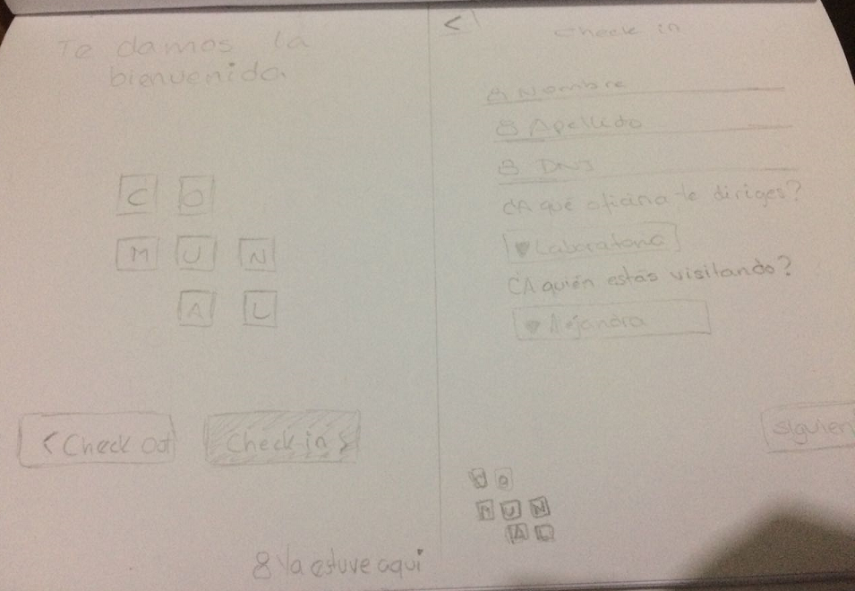
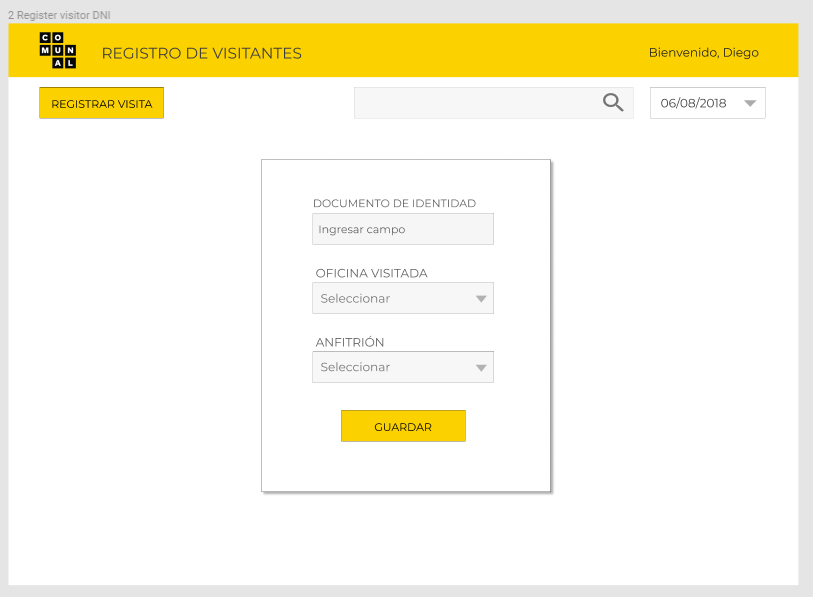
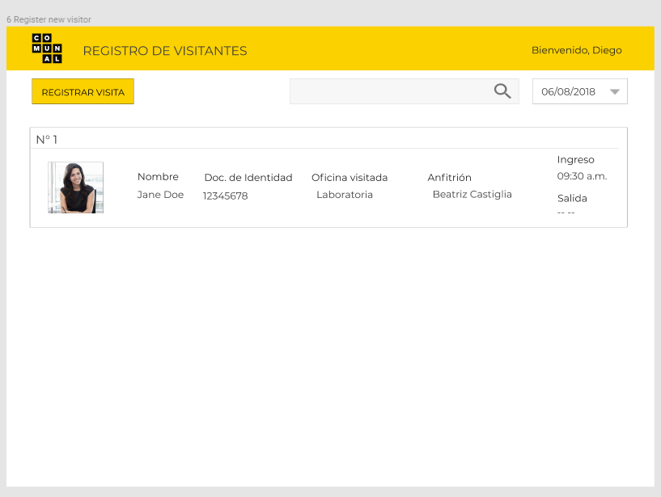
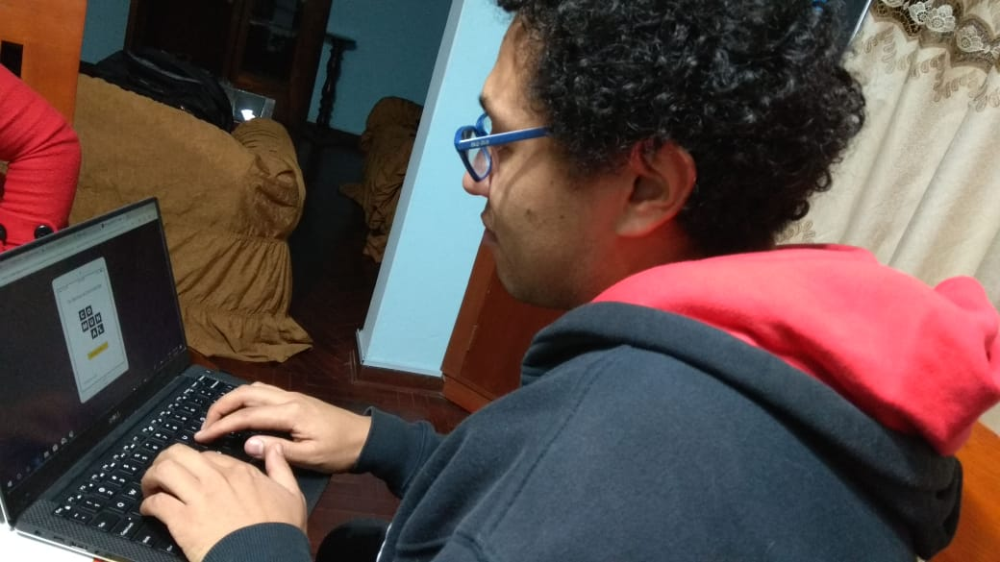

# Registro de visitantes para Comunal
## 1. Introducción
La empresa de coworking donde opera Laboratoria nos solicitó reinventar su proceso de registro de visitantes actual con el objetivo de mejorar su servicio y mantenerse competitivos con respecto a otras empresas del mismo rubro. Para ello, aplicamos técnicas de research con el objetivo de recabar información y entregar una propuesta que coincida con sus objetivos de empresa y valores de marca.

## 2. Proceso de planeamiento
Para iniciar el planeamiento nos organizamos como equipo utilizando el método Kanban.

Asimismo, como equipo nos organizamos en áreas de trabajo según lo siguiente:
* 01 Diseñadora UX, quien se encargó de diseñar la experiencia de la aplicación (flujo, interacción, etc.), así como identificar, documentar y priorizar las historias de usuario para plasmarlos en el  diseño visual de la interfaz.
* 02 Desarrolladoras Front-end, quienes debían implementar la interfaz de usuario diseñada (HTML/CSS/JS) y las pruebas unitarias.

## 3. Proceso de investigación
### 3.1 Lineamientos del cliente
Comunal es una empresa de coworking que ofrece diferentes opciones de espacios para todo tipo de empresas. Desde oficinas privadas para 200 personas, espacios Flex para nuevos emprendimientos, hasta Escritorios Dedicados para pequeñas empresas o equipos pequeños de emprendedores. Tiene una cultura organizacional que lo distingue de otras empresas de coworking pues prima el trato familiar y amical, llamándose a cada miembro de las oficinas "comuneros".

### 3.2 Benchmarking
Realizamos la investigación de 03 lugares en particular que cuentan con buenas prácticas en registro de visitantes y nos pueden dar un mayor acercamiento al objetivo y uso de herramientas digitales para el registro de visitantes.

### 3.3 Análisis de competencia
Identificamos como competencia directa a la empresa WeWork, empresa de coworking internacional con varias sedes en el país, quien en la actualidad cuenta con un registro virtual de visitantes. En sus sedes en el extranjero, cuentan con un registro anticipado de visitantes a través de una aplicación. Este registro debe hacerlo previamente el anfitrión, ingresando los datos y fotografía del invitado y subiendola a la app.

En sus sedes en el país, sus sistemas de registro varían entre el sistema electrónico a través de tablets y el sistema tradicional, donde el recepcionista toma los datos del visitado en una tabla.

### 3.4 Entrevistas
Se plantearon 03 tipos de entrevistas: 01 al cliente, en este caso, la empresa de coworking Comunal, 01 a un encargado de registro de un edificio, y 01 a usuarios que suelen visitar empresas y utilizar diferentes sistemas de registros. A continuación el listado de preguntas que se realizaron a cada tipo de usuarios:

**Guía de preguntas - Cliente**
1. ¿Cuántas empresas funcionan dentro de Comunal?
2. Durante el día, ¿cuántas visitas reciben aproximadamente?
3. ¿Qué datos les solicitan a las personas que vienen a visitar?
4. ¿Cuál es el sistema que usan para el registro de visitantes?
5. Si pudieran cambiar este sistema, ¿qué implementarían?
6. ¿Qué opinan sobre la implementación de un sistema tecnológico para el registro de visitantes?
7. ¿Qué opinan sobre darle la opción al visitante de elegir a quién viene a ver?
8. ¿Qué pasaría si las notificaciones de visita fueran por correo?
9. ¿En qué parte del edificio debería ubicarse esta aplicación?

**Guía de preguntas - Encargado de registro**
1. ¿Cuál es el proceso que siguen usualmente para el registro de visitantes?
2. ¿Se conoce previamente el nombre de visitantes que llegarán?
3. ¿Tienen algún formato o interfaz para el registro de visitas?
4. ¿Considera que les sería útil tener una interfaz donde el visitante se registre solo?

**Guía de preguntas - Visitante**
1. Cuando visitas empresas, sea por entrevistas u otros motivos, ¿qué tipo de sistemas de registros sueles encontrar?
2. ¿Qué datos usualmente te piden para poder ingresar a dichas empresa?
3. ¿Qué opinas del proceso de registro de visitas de esas empresas?
4. ¿Has visitado empresas con registro de visitantes virtual? Es decir, donde te registres en una Tablet o PC por tu cuenta.
5. De ser afirmativo, ¿qué te pareció el proceso de registro? ¿Fue sencillo? ¿Fue difícil? ¿Qué datos te pidieron?
6. De ser negativo, ¿te gustaría que las empresas implementen este tipo de registro?

#### Entrevista a cliente: Diego e Ivanna (Administración de Comunal)
_1. ¿Cuántas empresas funcionan dentro de Comunal?_
- Tenemos un aproximado de 50 empresas funcionando en este edificio.

_2. ¿Durante el día cuantas visitas reciben aproximadamente?_
- Depende mucho del día, al principio de la semana siempre hay mucho más que jueves o viernes, pero son aproximadamente entre 40 a 50 visitas.

_3. ¿Qué datos les solicitan a las personas que vienen a visitar?_
- En Comunal no le solicitamos ningún dato, pero la administración del edificio si tiene un registro de todos los ingresos y les piden el DNI. De lo que nos encargamos principalmente es de hacer el contacto de la visita con el cliente (oficinas). Como ya existe el primer filtro del edificio, consideramos que ya no es necesario pedir más datos a la visita, tan solo su nombre y a quién está buscando.

_4. ¿Cuál es el sistema que usan para el registro de visitantes?_
- No tenemos un sistema. Utilizamos un Whatsapp para comunicarnos con las empresas que están en nuestras instalaciones. 

_5. Si pudieran cambiar este sistema, ¿qué implementarían?_
- Creo que sería un beneficio tener un registro detallado de cuantas visitas recibimos, y así tendríamos un control más detallado y podríamos generar análisis de esos datos. Por ejemplo, cuantas visitas recibe cierta empresa, qué visitantes frecuentes tenemos, etc.

_6. ¿Qué opinan sobre la implementación de un sistema tecnológico para el registro de visitantes?_
- Sí ayudaría mucho, sin embargo, consideramos que también se pierde mucho el toque personalizado. En WeWork lo que sucede es que tú entras, llenas tus datos y le envían la notificación a la persona, pero no hay ese contacto humano de llegar y que la recepcionista te salude, y que ella se comunique con la persona a la que vienes a visitar. Para Comunal, es super importante ese toque humano, la calidez al ser recibido. Además, preferimos lo más sencillo, lo más amigable posible. Que este sistema no sea una carga más para el visitante.

_7. ¿Qué opinan sobre darle la opción al visitante de elegir a quién viene a ver?_
- Es delicado que una visita pueda ver las opciones de todo el personal que labora en cada oficina. Pasa también que viene gente que no conoce a quien va a ver, cuando vienen por entrevistas, ahí nosotros podemos derivarlos.

_8. ¿Qué pasaría si las notificaciones de visita fueran por correo?_
- Comunal se enfoca en darle todas las facilidades a los trabajadores; creemos que un correo más de recepción de Comunal no va a funcionar. Por eso usamos el whatsapp, porque es más directo y sencillo. Se usa el correo si, pero para visitar o eventos planificados con anticipación, porque podemos coordinar el numero de visitas, si necesitan estacionamiento, etc.

#### Entrevista a encargado de registro: recepcionista de edificio Armando Paredes (Barranco)
_1. ¿Cuál es el proceso que siguen usualmente para el registro de visitantes?_
- Lo que hacemos primero es consultar a qué oficina va y el motivo de su visita, con quien tiene la cita y de qué empresa viene. Se debe verificar eso con las personas que los invitaron, se les entrega un fotocheck y se les pide su documento de identidad. A veces se estanca un poco el proceso porque el invitado no conoce el número de la oficina o nosotros no tenemos todos los nombres de los trabajadores de cada oficina, entonces tenemos que llamar a la recepción de cada oficina y consultar para que aprueben el ingreso del visitante.

_2. ¿Se conoce previamente el nombre de visitantes que llegarán?_
- Las oficinas no suelen entregar una lista, eso solo pasa en caso de eventos especiales o reuniones planificadas con tiempo. Se verifican los DNI y nombres y solo así se dejan ingresar.

_3. ¿Tienen algún formato o interfaz para el registro de visitas?_
- El registro se suele guardar en un control de visitas de un archivo Excel. Se registran los datos de la persona, su DNI, la oficina a dónde se dirige, la hora de ingreso y la hora de salida. 

    Los horarios de ingreso y salida nos sirven en caso se presente alguna novedad durante la visita de la persona, ello nos ayuda a verificar con las cámaras cualquier situación que haya ocurrido y permite ahorrar tiempo, pues ya no tendríamos que revisar los sucesos de todo el día para encontrar esos detalles en particular.

_4. ¿Considera que les sería útil tener una interfaz donde el visitante se registre solo?_
- Sería valioso siempre que se hiciera previo a la visita, porque muchos se molestan cuando esperan o el registro se les hace demasiado largo. Quieren que se les atienda rápido y que haya alguien siempre que les de alguna respuesta. Si el proceso entre que la persona visitada lee el correo, lo confirma y acepta es muy largo, sería muy tedioso para el visitante y para la recepcionista.

#### Entrevista con visitante: publicista de la empresa Liquid

_1. Cuando visitas empresas, sea por entrevistas u otros motivos, ¿qué tipo de sistemas de registros sueles encontrar?_
- Todos los registros que hasta ahora he encontrado, son con DNI. En algunos te piden el DNI en recepción y lo tienes que dejar, y en otros te dan una tarjeta que te permite subir al ascensor, pero sólo al piso al que indicaste que irías. Pero siempre hay una recepción y te entregan un fotocheck.

_2. ¿Qué datos usualmente te piden para poder ingresar a dichas empresa?_
- Mi DNI, de donde vengo, y a quién busco. A veces me piden el piso u oficina que estoy buscando.

_3.	¿Qué opinas del proceso de registro de visitas de esas empresas?_
- Es bastante seguro para las mismas empresas. Una vez me olvidé el DNI cuando llegué y tuve que llamar a la persona que me había invitado para que mande correo y recién ahí pude ingresar. Creo que lo que molesta es la idea de esperar demasiado tiempo.

_4.¿Te gustaría que las empresas implementen este tipo de registro?_
- Sí sería bueno, pero de todas maneras considero que es importante que el usuario use su DNI como identificación porque así es más seguro y se podrá registrar el horario salida.

_5.	¿Has visitado empresas con registro de visitantes virtual? Es decir, donde te registres en una Tablet o PC por tu cuenta._
- Hasta el momento no, todas las que he visitado tienen el registro tradicional.
 

 

### 3.5 Usuarios identificados
Se identificaron 03 tipos de usuarios: visitante, visitado y administrador/recepcionista de Comunal, para los cuales se realizaron las siguientes **Historias de Usuario**:

1. Yo, como nuevo visitante en Comunal, quiero poder registrarme en esta aplicación para poder ingresar a las instalaciones de forma rápida y sencilla.
2. Yo, como nuevo visitante en Comunal, quiero poder seleccionar a la persona a quien vengo a visitar en la aplicación.
3. Yo, como nuevo visitante en Comunal, luego de haberme registrado, quiero poder enviar una notificación a la persona que vengo a visitar a través de esta aplicación.
4. Yo, como visitado, deseo poder recibir una notificación en mi correo cuando alguien viene a visitarme en mi oficina.
5. Yo, como administrador de Comunal, quiero poder visualizar los datos, foto, hora de ingreso y salida del nuevo visitante en mi interfaz.
6. Yo, como visitante, deseo poder registrar mi salida de las instalaciones de Comunal.

### 3.6 Principales problemas a resolver según usuarios identificados
1. El cliente (administrador/recepcionista de Comunal) no cuenta con un sistema de registro centralizado que le entregue datos que pueda analizar ni usar en un futuro para sus objetivos comerciales y de seguridad.
2. El visitante debe pasar por dos filtros de seguridad para poder llegar a su destino, lo cual genera molestias y uso del doble del tiempo de registro y espera.
3. La persona visitada debe esperar a recibir el mensaje en WhatsApp o llamada por teléfono para poder enterarse de que sus invitados han llegado.

## 4. Conclusiones de investigación
Siguiendo las necesidades del cliente y los lineamientos de su cultura organizacional, consideramos que es importante implementar un sistema de registro que involucre en gran medida el contacto humano y la familiaridad del recepcionista. 
 
Para esto, planteamos dos interfaces: una que le permita al usuario registrar sus datos por si solo y otra que le permita al recepcionista registrar a quién viene a visitar el usuario y guardar la hora de ingreso. De esta manera estaríamos integrando tecnología con el trato humano que tan importante es para el cliente.

## 5. Propuesta de aplicación
Para cumplir con las necesidades del usuario se propuso crear una aplicación que le permita ahorrar tiempo en el ingreso a las instalaciones de Comunal, mantener el calor humano en el trato entre Comunal-Visitante y aumentar los niveles de seguridad necesarios en un sistema de registro de visitantes.

**Diseño de interfaz**
Se propuso una interfaz sencilla, limpia e intuitiva, con pocos botones e información simplificada, de tal manera que sugiera que el proceso de registro es sencillo y rápido.

### 5.1 Prototipado
#### Prototipado de baja fidelidad
Se realizó un prototipado de baja fidelidad, el cual sirvió para realizar el primer testeo. Asimismo, se tomó como modelo para realizar el protitipado de alta fidelidad. El modelo propuesto está diseñado para usarse en pantallas tipo tablet o IPad, con un tamaño de 9,7'' como mínimo.*

#### Prototipo de alta fidelidad
Luego del proceso de investigación, diseñamos el primero prototipo de alta fidelidad, el cual nos sirvió como modelo para el maquetado principal y para realizar diferentes testing con posibles usuarios.

[Vista usuario visitante](https://www.figma.com/proto/SNAieaWmj6UB2t6pnGnbbZV2/Register-Comunal?node-id=1%3A2&scaling=scale-down)

Flujo de interfaz:
A continuación describimos el flujo de la primera interfaz planteada, la cual se encontrará posicionada en el primer registro del edificio. Se usará solo para visitas a oficinas de Comunal.
1. Pantalla de bienvenida: el visitante podrá escoger la opción "Primera visita". 
2. Vistas 2 a 6: el visitante ingresará sus datos y se tomará la foto necesaria para registrar sus datos en la base de visitantes de Comunal.
3. Vista 7: el visitante podrá verificar si sus datos se encuentran redactados correctamente y enviar su registro.
4. Vistas 9 al 10: se observa la opción de "registrar salida", en donde el visitante podrá registrar su salida de las instalaciones de Comunal, y se podrá guardar el horario de salida del mismo. 

[Vista administrador/recepcionista Comunal](https://www.figma.com/proto/SNAieaWmj6UB2t6pnGnbbZV2/Register-Comunal?node-id=119%3A116&scaling=scale-down)

Flujo de interfaz:
A continuación se describe el flujo de la segunda interfaz planteada, la cual solo podrá ser vista por el administrador/recepcionista de Comunal. Esta interfaz si está diseñada para desktop.
1. Pantalla de registro de usuario: el administrador podrá realizar el registro del usuario visitante a través de un modal, en el cual se podrá colocar el DNI del visitante previamente registrado en puerta (vista usuario visitante) e indicar a qué oficina y con quién se van a reunir dentro de Comunal.
2. Pantalla de visualización de data: el administrador podrá observar los datos del visitante ingresado, y encontrará un buscador e indicador de fecha, para poder filtrar la información.

**Testing con usuarios**
Se realizó el testing del prototipo con los usuarios visitantes para validar la usabilidad de la aplicación. Se obtuvieron los siguientes resultados:
- Se comprobó la simplicidad del diseño, puesto que hacía al prototipo muy intuitivo de usar.
- No se observó dificultados en el ingreso a la aplicación de registro.
- Se sugirió juntar los inputs "Nombre" y "Apellido" en un solo input.
- Los colores le fueron agradables y llamaban a la acción.

